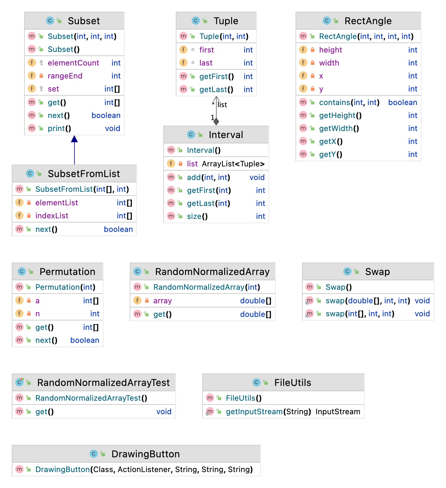

For Developers
============

You can also see [Python](https://github.com/starlangsoftware/Util-Py), [Cython](https://github.com/starlangsoftware/Util-Cy), [C++](https://github.com/starlangsoftware/Util-CPP), [C](https://github.com/starlangsoftware/Util-C), [Swift](https://github.com/starlangsoftware/Util-Swift), [Js](https://github.com/starlangsoftware/Util-Js), or [C#](https://github.com/starlangsoftware/Util-CS) repository.

## Requirements

* [Java Development Kit 8 or higher](#java), Open JDK or Oracle JDK
* [Maven](#maven)
* [Git](#git)

### Java 

To check if you have a compatible version of Java installed, use the following command:

    java -version
    
If you don't have a compatible version, you can download either [Oracle JDK](https://www.oracle.com/technetwork/java/javase/downloads/jdk8-downloads-2133151.html) or [OpenJDK](https://openjdk.java.net/install/)    

### Maven
To check if you have Maven installed, use the following command:

    mvn --version
    
To install Maven, you can follow the instructions [here](https://maven.apache.org/install.html).      

### Git

Install the [latest version of Git](https://git-scm.com/book/en/v2/Getting-Started-Installing-Git).

## Download Code

In order to work on code, create a fork from GitHub page. 
Use Git for cloning the code to your local or below line for Ubuntu:

	git clone <your-fork-git-link>

A directory called Util will be created. Or you can use below link for exploring the code:

	git clone https://github.com/olcaytaner/Util.git

## Open project with IntelliJ IDEA

Steps for opening the cloned project:

* Start IDE
* Select **File | Open** from main menu
* Choose `Util/pom.xml` file
* Select open as project option
* Couple of seconds, dependencies with Maven will be downloaded. 


## Compile

**From IDE**

After being done with the downloading and Maven indexing, select **Build Project** option from **Build** menu. After compilation process, user can run Util.

**From Console**

Go to `Util` directory and compile with 

     mvn compile 

## Generating jar files

**From IDE**

Use `package` of 'Lifecycle' from maven window on the right and from `Util` root module.

**From Console**

Use below line to generate jar file:

     mvn install

## Maven Usage

        <dependency>
            <groupId>io.github.starlangsoftware</groupId>
            <artifactId>Util</artifactId>
            <version>1.0.5</version>
        </dependency>

Detailed Description
============

+ [Interval](#interval)
+ [Subset](#subset)
+ [SubsetFromList](#subsetfromlist)
+ [Permutation](#permutation)

## Interval 

Aralık veri yapısını tutmak için Interval sınıfı

	a = new Interval();

1 ve 4 aralığı eklemek için

	a.add(1, 4);

i. aralığın başını getirmek için (yukarıdaki örnekteki 1 gibi)

	int getFirst(int index)

i. aralığın sonunu getirmek için (yukarıdaki örnekteki 4 gibi)

	int getLast(int index)

## Subset 

Altküme tanımlamak ve tüm altkümelere ulaşmak için Subset ve SubsetFromList sınıfları

Subset veri yapısını tanımlamak için

	Subset(int rangeStart, int rangeEnd, int elementCount)

Burada elemenCount elemanlı, elemanları rangeStart ile rangeEnd arasında değerler alabilen
tüm altkümeleri gezen bir yapıdan bahsediyoruz. Örneğin

Subset(1, 4, 2), bize iki elemanlı elemanlarını 1 ile 4 arasından gelen tüm alt kümeleri 
seçmek için kullanılan bir constructor'dır. Tüm altkümeleri elde etmek için

	a = new Subset(1, 4, 2);
	do{
		int[] subset = a.get();
		....
	}while(a.next());

Burada subset sırasıyla {1, 2}, {1, 3}, {1, 4}, {2, 3}, {2, 4}, {3, 4} altkümelerini gezer. 

## SubsetFromList 

Altküme tanımlamak ve tüm altkümelere ulaşmak için Subset ve SubsetFromList sınıfları

SubsetFromList veri yapısını kullanmak için

	SubsetFromList(int[] list, int elementCount)

Burada elementCount elemanlı, elemanları list listesinden çekilen değerler olan ve tüm 
altkümeleri gezen bir yapıdan bahsediyoruz. Örneğin

SubsetFromList({1, 2, 3, 4}, 3), bize üç elemanlı elemanlarını {1, 2, 3, 4} listesinden 
seçen ve tüm alt kümeleri gezmekte kullanılan bir constructor'dır. Tüm altkümeleri elde 
etmek için

	a = new SubsetFromList({1, 2, 3, 4}, 3);
	do{
		int[] subset = a.get();
		....
	}while(a.next());

Burada SubsetFromList sırasıyla {1, 2, 3}, {1, 2, 4}, {1, 3, 4}, {2, 3, 4} altkümelerini 
gezer. 

## Permutation

Permütasyon tanımlamak ve tüm permütasyonlara ulaşmak için Permutation sınıfı

	Permutation(n)

Burada 0 ile n - 1 arasındaki değerlerin tüm olası n'li permütasyonlarını gezen bir 
yapıdan bahsediyoruz. Örneğin

Permutation(5), bize değerleri 0 ile 4 arasında olan tüm 5'li permütasyonları gezmekte 
kullanılan bir constructor'dır. Tüm permütasyonları elde etmek için

	a = new Permutation(5)
	do{
		int[] permutation = a.get();
		...
	}while(a.next());

Burada Permutation sırasıyla {0, 1, 2, 3, 4}, {0, 1, 2, 4, 3} gibi permütasyonları gezer.

For Contibutors
============

### Class Diagram



### pom.xml file
1. Standard setup for packaging is similar to:
```
    <groupId>io.github.starlangsoftware</groupId>
    <artifactId>Amr</artifactId>
    <version>1.0.0</version>
    <packaging>jar</packaging>
    <name>NlpToolkit.Amr</name>
    <description>Abstract Meaning Representation Library</description>
    <url>https://github.com/StarlangSoftware/Amr</url>

    <organization>
        <name>io.github.starlangsoftware</name>
        <url>https://github.com/starlangsoftware</url>
    </organization>

    <licenses>
        <license>
            <name>The Apache Software License, Version 2.0</name>
            <url>http://www.apache.org/licenses/LICENSE-2.0.txt</url>
        </license>
    </licenses>

    <developers>
        <developer>
            <name>Olcay Taner Yildiz</name>
            <email>olcay.yildiz@ozyegin.edu.tr</email>
            <organization>Starlang Software</organization>
            <organizationUrl>http://www.starlangyazilim.com</organizationUrl>
        </developer>
    </developers>

    <scm>
        <connection>scm:git:git://github.com/starlangsoftware/amr.git</connection>
        <developerConnection>scm:git:ssh://github.com:starlangsoftware/amr.git</developerConnection>
        <url>http://github.com/starlangsoftware/amr/tree/master</url>
    </scm>

    <properties>
        <maven.compiler.source>1.8</maven.compiler.source>
        <maven.compiler.target>1.8</maven.compiler.target>
        <project.build.sourceEncoding>UTF-8</project.build.sourceEncoding>
    </properties>
```
2. Only top level dependencies should be added. Do not forget junit dependency.
```
    <dependencies>
        <dependency>
            <groupId>io.github.starlangsoftware</groupId>
            <artifactId>AnnotatedSentence</artifactId>
            <version>1.0.78</version>
        </dependency>
        <dependency>
            <groupId>junit</groupId>
            <artifactId>junit</artifactId>
            <version>4.13.1</version>
            <scope>test</scope>
        </dependency>
    </dependencies>
```
3. Maven compiler, gpg, source, javadoc plugings should be added.
```
	<plugin>
		<groupId>org.apache.maven.plugins</groupId>
		<artifactId>maven-compiler-plugin</artifactId>
		<version>3.6.1</version>
		<configuration>
			<source>1.8</source>
			<target>1.8</target>
		</configuration>
	</plugin>
	<plugin>
		<groupId>org.apache.maven.plugins</groupId>
		<artifactId>maven-gpg-plugin</artifactId>
		<version>1.6</version>
		<executions>
			<execution>
				<id>sign-artifacts</id>
				<phase>verify</phase>
				<goals>
					<goal>sign</goal>
				</goals>
			</execution>
		</executions>
	</plugin>
	<plugin>
		<groupId>org.apache.maven.plugins</groupId>
		<artifactId>maven-source-plugin</artifactId>
		<version>2.2.1</version>
		<executions>
			<execution>
				<id>attach-sources</id>
				<goals>
					<goal>jar-no-fork</goal>
				</goals>
			</execution>
		</executions>
	</plugin>
	<plugin>
		<groupId>org.apache.maven.plugins</groupId>
		<artifactId>maven-javadoc-plugin</artifactId>
		<configuration>
			<source>8</source>
		</configuration>
		<version>3.10.0</version>
		<executions>
			<execution>
				<id>attach-javadocs</id>
				<goals>
					<goal>jar</goal>
				</goals>
			</execution>
		</executions>
	</plugin>
```
4. Currently publishing plugin is Sonatype.
```
	<plugin>
		<groupId>org.sonatype.central</groupId>
		<artifactId>central-publishing-maven-plugin</artifactId>
		<version>0.8.0</version>
		<extensions>true</extensions>
		<configuration>
			<publishingServerId>central</publishingServerId>
			<autoPublish>true</autoPublish>
		</configuration>
	</plugin>
```
5. For UI jar files use assembly plugins.
```
	<plugin>
		<groupId>org.apache.maven.plugins</groupId>
		<artifactId>maven-assembly-plugin</artifactId>
		<version>2.2-beta-5</version>
		<executions>
			<execution>
				<id>sentence-dependency</id>
				<phase>package</phase>
				<goals>
					<goal>single</goal>
				</goals>
				<configuration>
					<archive>
						<manifest>
							<mainClass>Amr.Annotation.TestAmrFrame</mainClass>
						</manifest>
					</archive>
					<finalName>amr</finalName>
				</configuration>
			</execution>
		</executions>
		<configuration>
			<descriptorRefs>
				<descriptorRef>jar-with-dependencies</descriptorRef>
			</descriptorRefs>
			<appendAssemblyId>false</appendAssemblyId>
		</configuration>
	</plugin>
```
### Resources
1. Add resources to the resources subdirectory. These will include image files (necessary for UI), data files, etc.
   
### Java files
1. Do not forget to comment each function.
```
    /**
     * Returns the value of a given layer.
     * @param viewLayerType Layer for which the value questioned.
     * @return The value of the given layer.
     */
    public String getLayerInfo(ViewLayerType viewLayerType){
```
2. Function names should follow caml case.
```
    public MorphologicalParse getParse()
```
3. Write toString methods, if necessary.
4. Use Junit for writing test classes. Use test setup if necessary.
```
public class AnnotatedSentenceTest {
    AnnotatedSentence sentence0, sentence1, sentence2, sentence3, sentence4;
    AnnotatedSentence sentence5, sentence6, sentence7, sentence8, sentence9;

    @Before
    public void setUp() throws Exception {
        sentence0 = new AnnotatedSentence(new File("sentences/0000.dev"));
```
